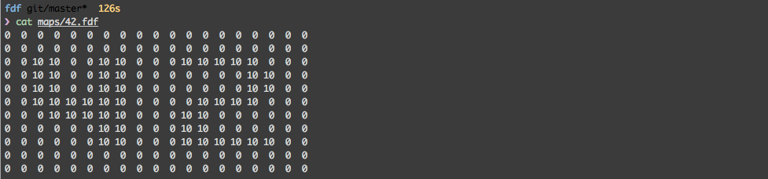
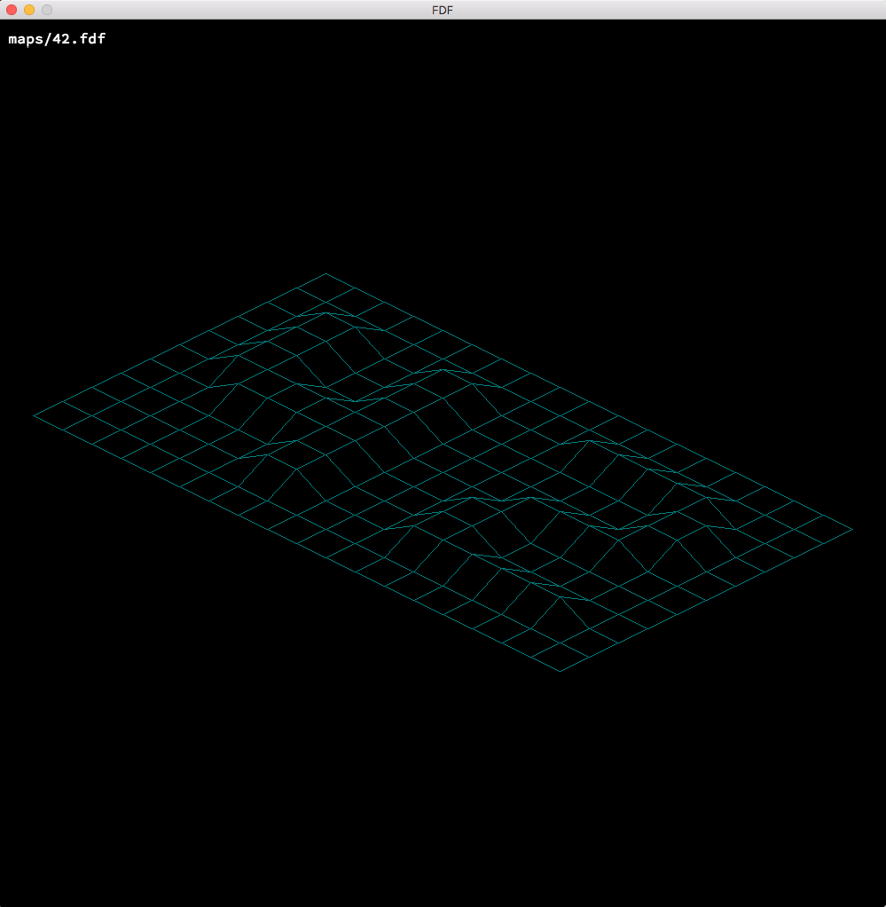

# fdf

Ce projet crée une representation en fil de fer d'une carte recu en paramètre, il utilise la miniLibx (librairie graphique de 42)



##compiler le programme
dans le dossier du projet :
```
make
```

##executer le programme
```
./fdf maps/42.fdf
```


